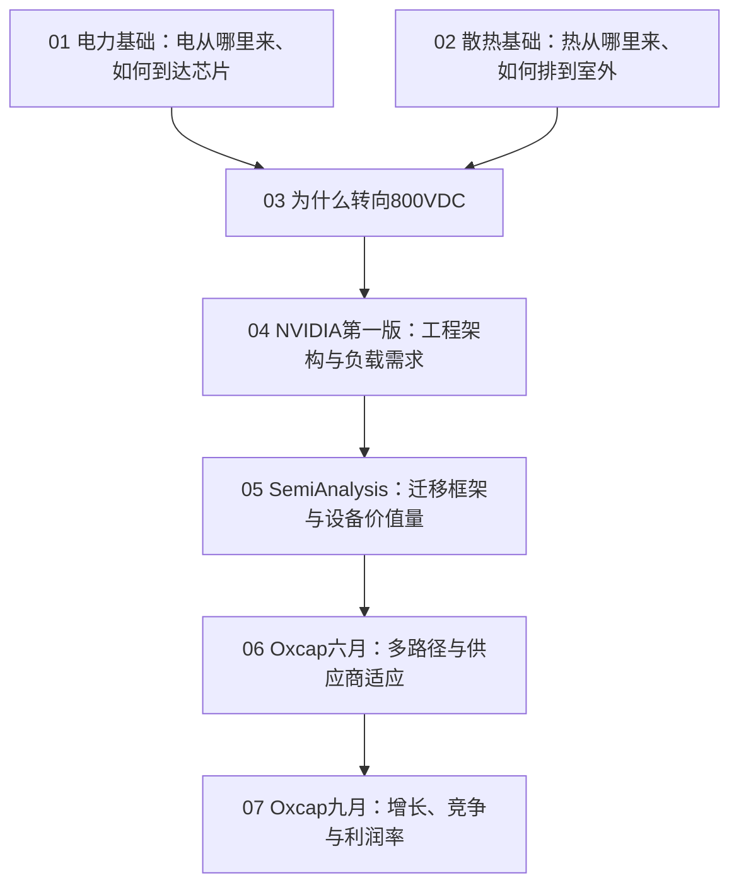

# 数据中心研究笔记

围绕数据中心电力、散热与800VDC架构建立连续的学习框架。按“基础设施 → 物理驱动 → 工程方案 → 设备价值迁移 → 行业竞争与利润”的顺序阅读。

## 阅读路线

| 层次 | 笔记 | 核心问题 |
| --- | --- | --- |
| 基础设施 | [01 · 电力与电气基础](notes/foundations/01-power-and-electrical-basics.md) | 电力如何从电网到达芯片？每类设备承担什么功能？ |
| 基础设施 | [02 · 散热系统基础](notes/foundations/02-cooling-system-basics.md) | 液冷改变了哪一段热传递？哪些设施仍然需要？ |
| 物理驱动 | [03 · 为什么转向800VDC](notes/800vdc/03-why-800vdc.md) | 为什么机柜功率密度会迫使供电电压与转换位置变化？ |
| 工程架构 | [04 · NVIDIA第一版架构笔记](notes/800vdc/04-nvidia-v1-architecture.md) | 计算平台需要怎样的配电、储能与电压转换？ |
| 产业迁移 | [05 · SemiAnalysis迁移框架](notes/industry/05-semianalysis-transition.md) | 哪些设备新增、移位或被替代？每MW价值量如何变化？ |
| 竞争格局 | [06 · Oxcap六月：价值迁移与供应商适应](notes/industry/06-oxcap-june-transition.md) | 不同方案能否并存？原有厂商如何调整产品组合？ |
| 利润分析 | [07 · Oxcap九月：增长与利润率](notes/industry/07-oxcap-september-cmd.md) | 收入增长和成功转型，是否足以维持原有利润率？ |

第一次阅读建议按01→07顺序；已有电力和散热基础，可以从03开始。比较报告观点时，把04的工程需求、05的迁移模型、06—07的产业判断放在一起看。

## 贯穿这些笔记的三个问题

1. **物理约束是什么？** 关注机柜密度、电流、铜排和电缆、转换损耗、热量及设备占用空间。
2. **设备功能如何实现？** 分清功能取消、产品形态改变、位置转移与功能集成；储能、保护和供电连续性的需求可能继续存在。
3. **经济价值归谁？** 分开看部署MW、每MW设备价值量、厂商份额与利润率，并考虑新建和改造、认证、供货和价格变化。

进一步串联逻辑：[研究框架](STUDY_MAP.md)。查阅来源及预测时点：[来源与版本](SOURCES.md)。

## 文件组织

- `notes/foundations/`：电力与散热基础。
- `notes/800vdc/`：800VDC驱动逻辑与NVIDIA第一版架构笔记。
- `notes/industry/`：SemiAnalysis与Oxcap阅读笔记。
- `originals/`：七份原Word笔记，保留原文和排版。
- `assets/`：原笔记中的图示。

Markdown保留原笔记的正文、表格和图示，增加中文阅读定位、提示及前后篇导航。原笔记中的市场规模、成本、技术时间表和厂商判断均按对应来源与日期理解。

整理日期：2026年9月24日。
