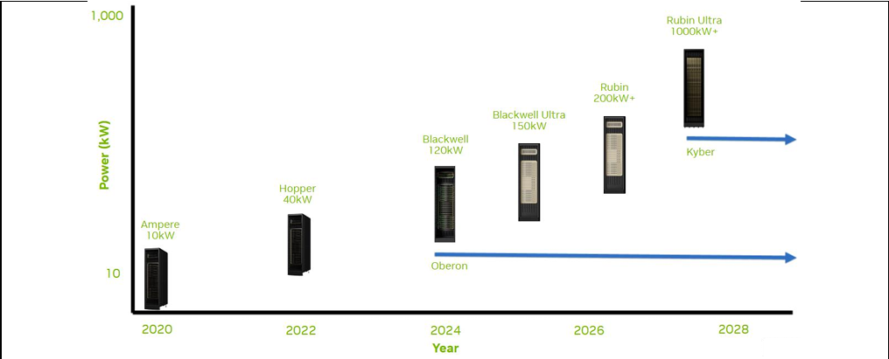

# From Chip Power to 800 VDC

**阅读定位：** 把芯片功耗、NVLink域、机柜功率密度、电流与铜耗连接成一条因果链。

**阅读提示：** 提高配电电压与减少转换级数是两项不同收益；过渡方案未必同时实现。

[返回学习目录](../../README.md) · [通篇逻辑梳理](../../STUDY_MAP.md) · [查看原Word笔记](../../originals/03_Why_AI_Data_Center_Are_Moving_to_800VDC%20%28Personal%29.docx)

**对应资料：** [NVIDIA第一版PDF](../../references/nvidia-800vdc-architecture-v1.pdf) · [SemiAnalysis 800VDC原文归档](../../references/semianalysis-800vdc-revolution-part-1.html) · [完整来源目录](../../SOURCES.md)

---

**Why AI data centers need a new power-delivery architecture**

**Consolidated logic, with source from multiple reports**

## Key takeaway

**The core logic is** **about** **power density.** AI accelerators deliver more compute each generation, but they also draw more power. At the same time, the industry is moving from standalone multi-GPU servers toward tightly coupled rack-scale systems. The result is a rapid rise in rack power from tens of kilowatts to well above 100 kW+ today, with megawatt-class racks becoming a design target. At that density, traditional low-voltage rack power distribution becomes physically and economically inefficient because current, copper, conversion equipment and heat all scale unfavourably. **Raising the distribution voltage to 800 VDC is therefore an architectural response to the power-density bottleneck**: it lowers current, reduces copper and cable bulk, frees rack space for computing, cuts conversion stages and improves end-to-end efficiency.

**Efficiency is another important driver behind the shift toward DC architecture.** IT equipment ultimately operates on DC power, while a conventional data-center power chain may repeatedly convert between AC and DC — for example through the UPS, rack-level PSU and downstream DC/DC stages — with losses incurred at each conversion. Moving more of the power train to DC allows operators to consolidate or remove some of these stages and improve end-to-end efficiency. This idea predates 800VDC: earlier DC architectures, **including DC systems such as the** **240V HVDC and** **Panama Power**, were already designed partly to reduce unnecessary AC/DC conversions and lower power losses. 800VDC extends the same principle to much higher rack densities: the higher voltage addresses the current, copper and space constraints of AI racks, while the more DC-native architecture can simultaneously reduce conversion losses.

## The story in one page

| **Step** | **What changes** | **Why it matters** | **Implication** |
| --- | --- | --- | --- |
| 1. Chip | GPU compute rises rapidly; chip TDP also trends upward. | More power is required per accelerator and per server. | Electrical infrastructure becomes part of the compute-scaling constraint. |
| 2. System | Architecture shifts from 8-GPU servers to rack-scale systems connected by high-bandwidth scale-up fabrics. | Many accelerators are concentrated in a single rack-scale system. | Draw more power |
| 3. Rack | System packed into rack, meaning higher power requirement; NVIDIA is designing for 1 MW-class racks and beyond. | At low voltage, the required current becomes extremely large. | Busbars, cables, power shelves and cooling consume excessive space and material. |
| 4. Physics | For a given power, P = V × I. Higher voltage means lower current. Conduction loss scales with I²**R**. | Lower current reduces conductor size, copper mass and resistive losses. | Move power distribution to a much higher DC voltage. |
| 5. Architecture | 800 VDC distributes high-voltage DC closer to compute and reduces repeated power conversion. | More of the rack can be used for compute; power path is simpler and more efficient. | 800 VDC becomes a key enabling architecture for future AI factories. |
| 6. Ecosystem | Higher-voltage DC changes UPS/BBU placement, transient-energy buffering, DC protection and conversion components. | The transition affects the full electrical value chain, not just the rack PSU. | New opportunities emerge in rectifiers, DC/DC, solid-state protection, capacitors, busways and energy storage. |

## 1. Start at the chip: more compute also means more power

**Core message.** Accelerator performance has increased dramatically across NVIDIA generations, while absolute device power has also risen. The exact ratio varies by product and workload, but the directional conclusion is robust: the electrical power per high-end accelerator is materially higher than it was in the V100/H100 era.

- Starts from chip evolution because the downstream power architecture is ultimately driven by compute density.

- Do not interpret higher TDP as “worse efficiency”. Newer GPUs can deliver much more compute per watt even while drawing more absolute power.

- The infrastructure challenge is therefore absolute power density: more compute is packed into less physical space.

## 2. The bigger shift is from server-scale to rack-scale computing

**Core message.** The power step-up is amplified by system architecture. Historically, an 8-GPU server could sit in the ~10–20 kW class. Modern AI systems increasingly connect many accelerators into a tightly integrated rack-scale compute domain using NVLink and related high-bandwidth interconnects.

- GB300 NVL72 integrates 72 Blackwell Ultra GPUs and 36 Grace CPUs in one liquid-cooled rack-scale system.

- NVIDIA documents up to ~142 kW for a full GB300 NVL72 rack.

- The Kyber rack generation requires more power and NVIDIA’s moving toward 1 MW-class rack power in 2027 and beyond.

**Key takeaway:** the design unit is moving from “one server” to “one rack / one rack-scale system”. That concentrates both compute and electrical demand.

## 3. Why low-voltage rack power becomes a bottleneck

**The basic physics is simple:** P = V × I. If rack power rises but distribution voltage stays low, current must rise sharply. Higher current then drives three problems at once.

- Copper and conductor size: higher current requires much larger busbars and cables. NVIDIA notes that a 1 MW rack using a 54 VDC architecture could require up to ~200 kg of copper busbar (can’t fit into rack and economically not feasible).

- Energy loss and heat: conductor losses scale approximately with I²R, so lowering current materially reduces resistive loss and the heat generated in the power path.

- Rack-space pressure: low-voltage architectures require more power shelves and bulky power-delivery hardware. At megawatt scale, power equipment can crowd out the very compute equipment the rack is supposed to host.

Problem is no longer just “how much power is available to the building”; it is “how to physically deliver that power to a very dense rack”.

## 4. Why 800 VDC solves the rack-density problem

- Lower current for the same power, which reduces conductor cross-section, copper use and cable bulk.

- Lower distribution loss because resistive loss falls as current falls.

- Fewer conversion stages: the future-state architecture can convert facility AC to 800 VDC once and distribute DC directly toward compute.

- More usable rack space: rack-level AC/DC or bulky low-voltage power shelves can be reduced or moved out of the compute rack.

- A more scalable power path for several-hundred-kW and eventually MW-class racks.

**NVIDIA’s current framing is therefore “chip-to-grid”:** power architecture, cooling, rack mechanics and compute are designed together rather than as independent layers.

## 5. Where the 800 V conversion happens can evolve in stages

**Three power-density** **bands to** **explain where conversion hardware may sit.** These are useful conceptual heuristics, but they should not be presented as universal industry standards; actual thresholds depend on vendor design, redundancy, rack geometry and facility architecture.

| **Conceptual band** | **Conversion location** | **What it means** | **How to describe it safely** |
| --- | --- | --- | --- |
| < ~120 kW | Inside / attached to the rack power shelf | Conventional rack-level conversion can still be feasible. | Illustrative architecture; not a hard industry cutoff. |
| ~120–500 kW | Sidecar / adjacent power rack | Move bulky conversion hardware out of the compute rack while still delivering high-voltage DC nearby. | Consistent with NVIDIA’s hybrid 800 VDC power-rack / sidecar concept for existing AC facilities. |
| > ~500 kW | 800 VDC increasingly pushed closer to the IT board / high-voltage DC/DC stage | At very high density, minimising low-voltage distribution distance becomes critical. | Directionally valid; exact topology and threshold are platform-specific. |

## 6. The facility migration path: from today’s AC systems to native 800 VDC

- Hybrid / retrofit stage — existing AC facility + sidecar（HVDC）. AC infrastructure remains, while an adjacent power system supplies 800 VDC to next-generation compute racks. **This allows brownfield data centers to adopt higher-density AI systems without redesigning the entire building.**

- 800 VDC distribution stage — facility power is rectified to a common 800 VDC bus and distributed closer to the IT load, reducing repeated AC/DC conversions and simplifying the downstream path.

- More integrated future stage — technologies such as solid-state transformers (SSTs) may combine voltage transformation and rectification, potentially shortening the chain from medium-voltage AC to low-voltage DC distribution. This is an emerging architecture rather than a fully standardised end state today.

## 7. Other changes 800 VDC create across the power system

### Transient power and energy buffering

AI/GPU workloads can change power rapidly. The grid and upstream electrical system prefer stable, predictable load. Local energy buffering — e.g., BBUs, batteries or capacitor-based buffer units — can absorb or supply short-duration power so the upstream system sees a smoother profile.

### UPS / BBU architecture

Data centers have been moving from large centralised UPS-only architectures toward more distributed energy storage in some designs. Rack-level or server-level BBUs place backup energy closer to the load and can reduce central conversion stages, although redundancy strategy and required backup duration remain site-specific.

### DC protection

DC faults are harder to interrupt than AC faults because DC current has no natural zero crossing. Wider adoption of 800 VDC therefore increases the importance of DC-rated fuses, mechanical DC breakers and solid-state / hybrid circuit breakers, together with coordinated fault-current limiting.

### Power electronics

Higher-voltage DC increases demand for efficient rectifiers, high-voltage DC/DC modules, wide-bandgap semiconductors, magnetic components, capacitors and high-voltage connectors/busways.

### Cooling and layout

Higher rack power and electrical density reinforce the move toward liquid cooling and more integrated rack design. Power, cooling and compute layouts have to be engineered together.

## 8. What should remember

- 800 VDC is not being adopted because “DC is inherently better than AC” in every situation; it is a response to very high AI rack power density.

- The causal chain is: more compute → higher chip and system power → rack-scale concentration → much higher current at low voltage → copper / loss / space bottlenecks → higher-voltage DC distribution.

- The most important economic benefit is not only electrical efficiency. It is also enabling more compute per rack and per square metre while reducing power-delivery hardware and material.

- The transition will be gradual. Brownfield sites can use hybrid sidecar / power-rack designs before new facilities move toward native 800 VDC distribution.

- 800 VDC changes the component opportunity set across rectification, DC/DC conversion, protection, energy storage, busways, connectors, capacitors and thermal management.

## Terminology guide

| **Term** | **Practical meaning** |
| --- | --- |
| **TDP** | Thermal Design Power; commonly used as a practical indicator of a processor/accelerator power envelope. |
| **Rack-scale system** | A compute system designed so an entire rack operates as one tightly coupled compute domain, rather than as independent servers. |
| **Power shelf** | Rack-mounted power-conversion assembly containing multiple PSUs / rectifiers. |
| **Sidecar / power rack** | A separate adjacent enclosure or rack that houses power-conversion and/or energy-storage equipment, freeing space in the compute rack. |
| **BBU** | Battery Backup Unit. |
| **CBU** | Capacitor Buffer Unit; typically used to buffer fast transient power rather than provide long-duration backup. |
| **HVDC / LVDC** | High-voltage / low-voltage direct-current distribution. Naming conventions vary by region and vendor. |
| **SST** | Solid-State Transformer; a power-electronics-based transformer concept that can combine transformation, isolation and conversion functions. |
| **Busway / busbar** | High-current conductor system used to distribute power within the facility or rack. |
| **VRM** | Voltage Regulator Module; final-stage regulation close to the processor/GPU. |

## source

**NVIDIA, “800 VDC Architecture for AI Data Centers”** https://www.nvidia.com/en-us/data-center/technologies/800-vdc-architecture/ Official overview of why 800 VDC is being adopted; lower current, lower copper/cable bulk, fewer conversion stages, future AI-server support.

**NVIDIA Technical Blog, “NVIDIA 800 VDC Architecture Will Power the Next Generation of AI Factories” (20 May 2025)** https://developer.nvidia.com/blog/?p=100571 Official discussion of 1 MW+ racks, 54 VDC limitations, copper/busbar burden and architecture transition.

**NVIDIA NVL72 AI Factory Reference Architecture — System Hardware & Components** https://docs.nvidia.com/enterprise-reference-architectures/nvl72-ai-factory/latest/components.html GB300 NVL72 hardware details; full rack up to ~142 kW.

**NVIDIA Blog, “Why Scaling AI Compute Performance Requires a New Power Architecture” (11 Aug 2026)** https://blogs.nvidia.com/blog/800-vdc-power-architecture-ai-factory/ Current description of hybrid power-rack approach and transition from AC to native 800 VDC.

**Open Compute Project, “Power Architecture Evolution in Data Centers” (2025)** https://www.opencompute.org/documents/power-architecture-evolution-in-data-centers-pdf Industry discussion of next-generation 800 V HVDC power delivery and in-rack DC/DC conversion.

---

[上一篇：散热系统基础](../foundations/02-cooling-system-basics.md) · [下一篇：NVIDIA第一版架构笔记](../800vdc/04-nvidia-v1-architecture.md)
